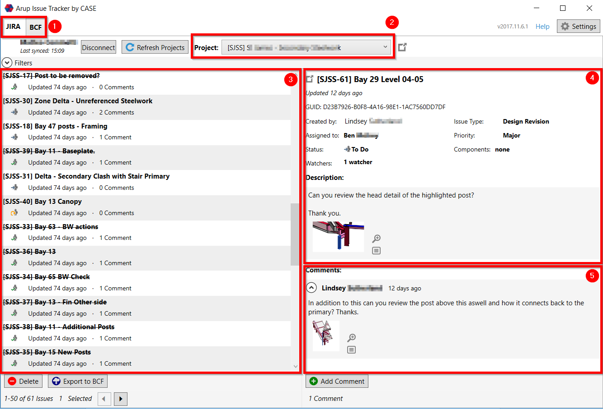
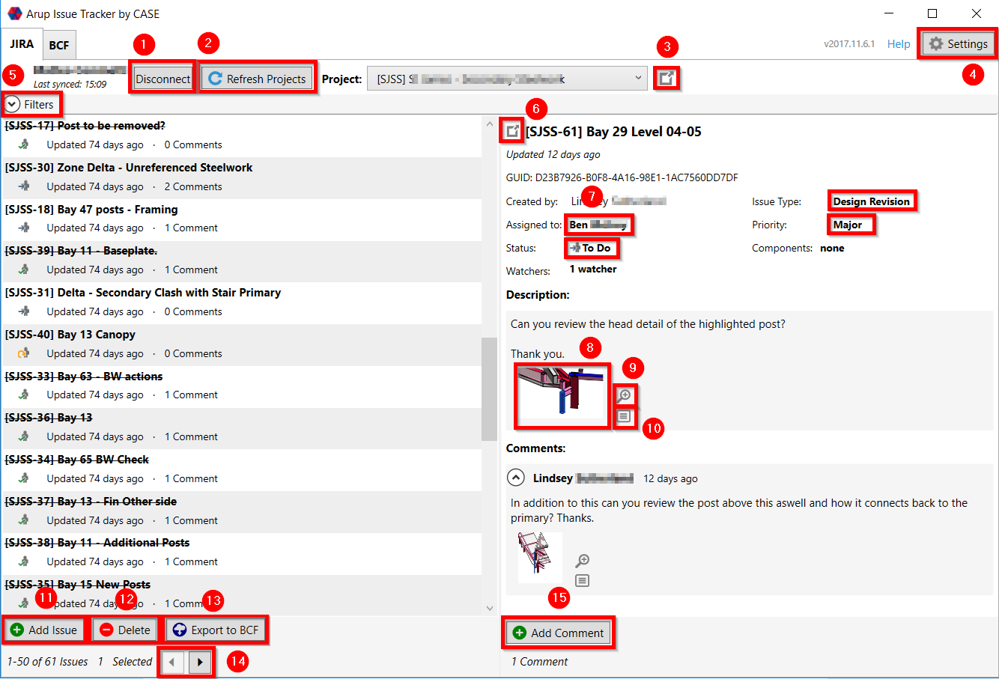
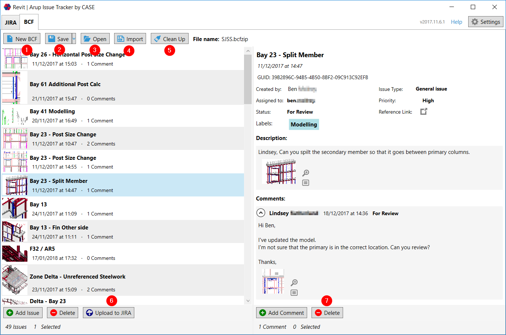
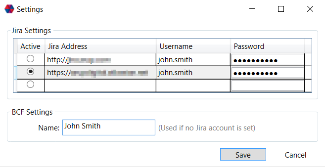
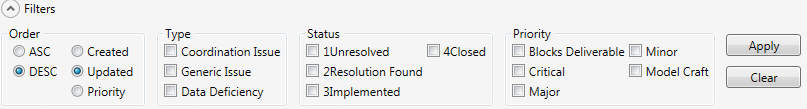
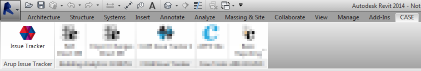
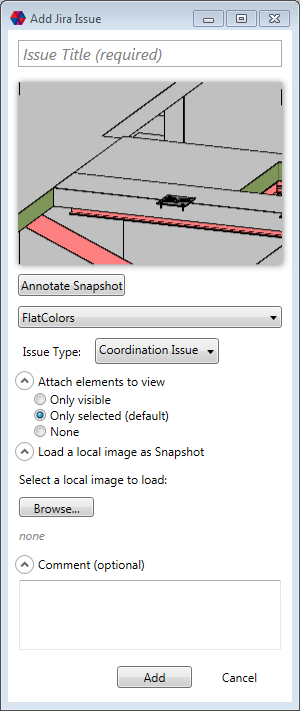
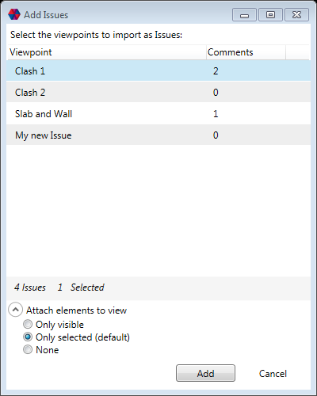
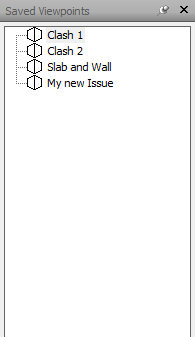
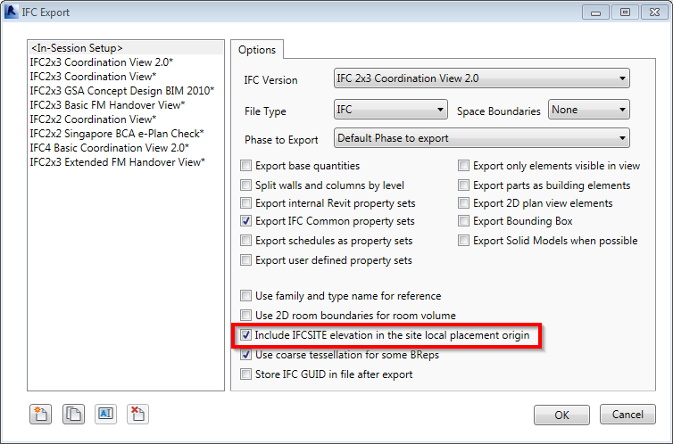

# Arup/CASE Issue Tracker

**Software Documentation**
Created: June 04, 2014
Last update: February 12, 2018

## Introduction

This document describes the functionalities and use of the Arup Issue Tracker (AIT) initially developed by CASE and then extended by Arup.

### Summary

The Arup Issue Tracker (AIT) is a set of tools designed to manage the electronic workflow for reviewing and amending BIM models. It currently works with Revit, Navisworks, Tekla BIMSight and Tekla Structures.

The tools can be used to store a list of 'Issues' in either a BCF file (BIM Collaboration Format) or using a web-based 'Issue Tracker' called Jira. This Issues can then be assignened, tracked and managed by the team in order to manage updates and tasks within the BIM model.

AIT is made up of the following applications:

- standalone Windows application (BCF 1.0 and BCF 2.0)
- Autodesk Revit 2014-2018
- Autodesk Navisworks 2014-2018
- Autodesk AutoCAD 2014-2018 compliant products, e.g., Civil 3D, Map 3D
- Bentley MicroStation compliant products including SELECTseries and CONNECT editions, e.g., AECOsim Building Designer, Power Rail Track
- All other BCF-compliant products, e.g, Solibri Model Checker, Trimble Tekla Structures

### Requirements

- An instance of [Atlassian Jira](https://www.atlassian.com/software/jira), local or cloud, is needed to fully use the AIT. See at the end of the documentation how to configure it if you are creating a new one.
- To have better exports from Revit to IFC it is recommended to have installed and use [IFC Exporter for Revit](https://sourceforge.net/projects/ifcexporter/).

### Installation

Grab the latest installer from [github](https://github.com/ArupAus/issue-tracker/releases) and follow the installation wizard. The first time you run AIT you'll be prompted for your Jira credentials. By default the username is your `firstname.lastname`. 

Please note, the Jira Address field is not expecting a final `/`.


## Interface

User interface is consistent across the various clients/plugins. The Jira panel lets the user connect to the Jira server and manage, import, export issues. The BCF panel is for managing BCF reports (.bcfzip files) and BCF issues.

### Jira panel

#### Layout



1. Tab control to switch between the Jira and BCF panels
2. Jira Project selection combo box
3. Issue List
4. Selected issue details (if multiple issues are selected, will display only the first)
5. Selected issue comments

#### Actions



1. Disconnect from Jira
2. Reloads the list of projects and permissions
3. Opens the selected project in the browser
4. Opens the Settings window
5. Expands the Filter section (see specific page)
6. Opens the selected issue in the browser
7. Changes Issue Fields like Assignee, Issue Type, Status or Priority for the selected issue or issues (change of status will only be applied to the first selected)
5. Opens the Snapshot in a new window
6. Opens a 3D view to see the issue and elements involved, not available in the standalone version
7. Opens a windows containing a list of attached elements
8. Creates a new Issue directly into Jira (see specific page)
9. Deletes the selected issues
10. Exports the selected issues to BCF. Only issues that have a viewpoint.bcfv and a snapshot.png attachments will be exported.
11. Pagination for when there are more than 50 issues in the list
15. Adds a comment to the selected issue or issues

### BCF panel

#### Layout

The BCF panel is very similar to the Jira panel, the project dropdown is replaced by a menu.

#### Actions




Same as in the Jira panel with some exceptions:

1. Creates a new report
2. Prompts to save the current report as BCF 1.0 or 2.0
3. Opens an existing report (reports can be also opened by dragging them onto the application's main window)
4. Merge a BCF report into the current one
5. Remove all attached model components
4. Prompts to upload the selected issues to Jira
7. Deletes the selected issue or issues

## Settings

The settings window allows you to set the credentials of your Jira account/s.  By default the username is your name.surname. Please note, the Jira Address field is not expecting a final `/`.




### Revit Project Settings (optional)

Revit Projects Setting are optional and not created by default. In order to set up a Revit project settings file it is necessary to create a .bcfconfig file in the same folder as the .rvt file named exactly as the Revit file (including extension). Therefore, for a `SampleProject.rvt` you'll need a `SampleProject.rvt.bcfconfig` file in the same directory and it will only affect BCF files used on that project.

The content of the `.bcfconfig` has to be structured as follows:

```xml
<?xml version="1.0" encoding="utf-8"?>
<configuration>
    <appSettings>
    	<add key="useDefaultZoom" value="0" />
    </appSettings>
</configuration>
```

#### useDefaultZoom

`Boolean (0 = false, 1 = true), default value: 0`

Set it to 1 if working to/from Tekla so that Orthographic and Perspective views will be adjusted to its zoom factor. If not planning to exchange BCF files with Tekla set it to 1 so that views will not be scaled.

## Usage

All addins work similarly although AIT for Windows does not provide functionality to create new issues and open viewpoints, and issues are created slightly differently in Navisworks.

### General usage (AIT for Windows)

In no shortcut was created during installation, AIT for Windows can be accessed from:

`[DRIVE]:\Program Files (x86)\CASE\ARUP Issue Tracker\ARUP.IssueTracker.Win.exe`

If on a x86 system:

`[DRIVE]:\Program Files\CASE\ARUP Issue Tracker\ARUP.IssueTracker.Win.exe`

All the following features are also available in AIT for Revit and Navisworks.

#### Filters



Issues can be filtered by Issue Type, Status and Priority. After selecting one or more filters and clicking "Apply" the filter bar will be highlighted.

N.B.

If a certain Issue Type, Status or Priority is being filtered out and a new issue with that Issue Type, Status or Priority is created it won't be visible until that filter is cleared.

Order, not being a real filter, is always applied to the query retrieving the list of issues.

#### Export Jira issues to BCF

From the Jira panel, by selecting one or more issues and clicking the "Export to BCF" it is possible to create a new BCF report containing the issues.

It is important to keep in mind the following:

- The BCF issue and comments creation dates will reflect JIRA's creation dates
- The BCF comments author dates will reflect JIRA's author
- A new GUID will be generated for each issue that does not have one set as JIRA's GUID custom field

#### Upload BCF issues to JIRA

From the BCF panel, by selecting one or more issues and clicking the "Upload to JIRA" it is possible to create new Jira issues. The user will be prompted to select a project and an Issue Type for the new issues.

It is important to keep in mind the following:

- Author of the issues and comments will be the user currently logged in with a Jira account and not the one set in the BCF file
- Creation date and date of issues and comments will be the current time while the operation is processing
- **If an issue with the same GUID is already existing in Jira only new comments will be uploaded** (by new comments it is intended comments whose content does not already appear in the selected issue)

### Use in Revit

The AIT for Revit can be accessed from the CASE ribbon panel.



#### Add an Issue

Adding a new issue to a Jira project or to a BCF report follows the same procedure. The active view has to be either a 3D view (orthographic) or a camera view (perspective). After clicking the "Add Issue" button, the following window will appear:



- An issue title is required
- The generated snapshot can be annotated clicking on "Annotate Snapshot" (N.B. you need to save and then close MS Paint for the changes to take effect)
- The "Attach elements to view" section lets the user decide which elements to attach to the issue. N.B. to attach selected elements, those needs to be selected before clicking the "Add Issue" button
- It is possible to change visual style of the snapshot by selecting a different one via the drop down menu
- It is also possible to load a local image via the "Browse" button
- Optionally a first comment can be added to the issue

#### Open a 3D View

Opening a 3D view in Revit can only be done if the active view is not a perspective (camera) view, in that case switch to any other type of view (2D or 3D).

### Use in Navisworks

#### Add an Issue

Issues in Navisworks are added from existing Saved Viewpoints. The process of adding a new issue is different than in Revit since it's a batch upload.





After Clicking "Add Issue" it is possible to select one or more Viewpoints to add as issues, the "Attach elements to view" section lets the user decide which elements to attach to the issue. 

N.B. to attach selected elements, they needs to be selected **before** clicking the "Add Issue" button. Only Selected Viewpoints will be uploaded and their comments will be used as BCF or Jira comments.

### Model export from Revit

#### Revit to Tekla

Please refer to the requirements chapter before proceeding. Go to: *Revit>Export>IFC>Modify Setup…*

Mind to check "Include IFCSITE Elevation in the site local placement origin".



#### Revit to Navisworks

For optimal results, it is suggested to use the NWC export utility from within Revit and export as NWC or to use an IFC file generated as mentioned above.

### Known Limitations

- The way BCF files are interpreted/created by software vendors is different, in particular concerning the FOV of perspective views and the scale of orthogonal views. Viewpoints might result in having different "zoom/scale" and location. AIT is optimized to work with Tekla BIM Sight and Navisworks, but full compatibility cannot be guaranteed with BCF files coming from other software
- No native tools as section boxes or crop regions are supported
- When uploading BCF files to Jira the issue and comment dates will reflect the creation date on Jira and not the one of the BCF file itself
- Attaching all the visible elements to a new issue from very big models in Navisworks and Revit could crash the application since it needs to loop through all the model's elements
- A current limitation in the Revit API does not allow to access elements that are part of a linked model. Consequence is that attached elements cannot include linked models


## Jira Setup

An [Atlassian Jira](https://www.atlassian.com/software/jira) instance, local or cloud, is needed to fully use the AIT.

- [Jira REST API enabled](https://confluence.atlassian.com/doc/enabling-the-remote-api-150460.html)
- The Jira instance to have a custom field named GUID with ID: customfield_10900 (if building from source replace this value](https://github.com/ArupAus/issue-tracker/blob/59995d4c794010cb43ed123f6499e92baad9ea1a/ARUP.IssueTracker2/Classes/MySettings.cs#L34))
- The following fields to be accessible for the designed Jira projects:
  - Summary
  - Key
  - Created
  - Updated
  - Description
  - Assignee
  - Comment
  - Attachment
  - Reporter
  - Status
  - Priority
  - Resolution
  - Issuetype
- User accounts with permission to create issues in the designed Jira projects